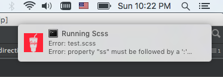
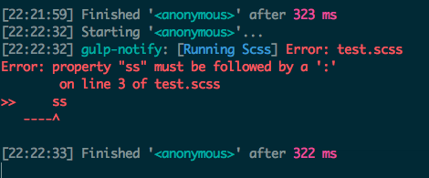

# 不中断Gulp任务且弹出系统通知

## 简要介绍

在使用 gulp 的时候, 有时候监听文件变化, 但是写 scss 或者 js 的时候出现了语法错误, 这个时候保存文件....

往往会中断 gulp 任务, 频繁的重启会很烦....

这个小组合呢就是在任务出现异常的时候通过系统通知的形式来提醒我们. 在开发的时候还是很棒的!

福利: Mac 上面还可以选择不同的提示声音呢.

## 推荐程度 5颗星

## 有关插件

+ [gulp-notify](https://github.com/mikaelbr/gulp-notify) - Send messages to Mac Notification Center, Linux notifications (using notify-send) or Windows >= 8
+ [gulp-plumber](https://github.com/floatdrop/gulp-plumber) - Prevent pipe breaking caused by errors from gulp plugins

## 使用说明

启动 default 任务, 尝试修改 `test.scss` 文件, 可以故意写错, 然后保存.

如果是 Mac 的话, 可以听到一声清脆的玻璃声, 然后看到屏幕右上角



再来看 terminal



任务并没有结束.

尝试去掉15行

```
    .pipe(customerPlumber('Running Scss')) // 尝试去掉这一行

```

然后在运行以下, 故意写错, 看看是什么吧~